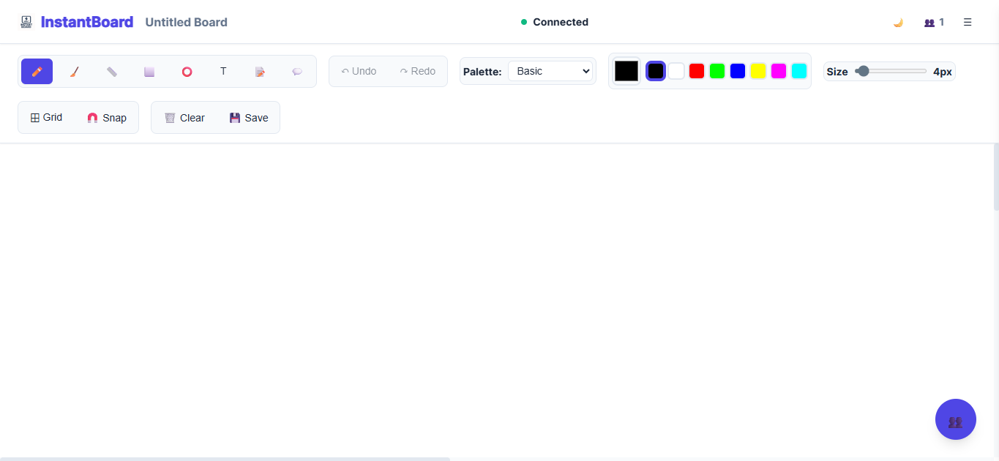

# 🎨 InstantBoard

**InstantBoard** is your go-to online whiteboard for instant, real-time collaboration. No signups, no downloads—just open the link and start creating together!

  

---

## What is InstantBoard?

InstantBoard is a free, web-based whiteboard that lets you and your friends, classmates, or teammates draw, write, brainstorm, and plan together in real time. Everything you do is instantly visible to everyone else—it's like being in the same room, even when you're not!

---

## Why You'll Love It

- **Instant Access:** Just open [https://instant-board.vercel.app](https://instant-board.vercel.app) and start drawing—no account needed.
- **Real-Time Collaboration:** See everyone's drawings, notes, and changes live as they happen.
- **Sticky Notes & Comments:** Add colorful sticky notes and comments anywhere on the board for brainstorming and feedback.
- **Easy Sharing:** Share your board with a simple link or QR code. Anyone can join and contribute instantly.
- **Customizable Tools:** Choose from multiple drawing tools, colors, and brush sizes. Toggle grid and snap-to-grid for precision.
- **Download & Save:** Export your board as a high-quality PNG image with one click.
- **Works Everywhere:** Use it on your laptop, tablet, or phone—no installation required.

---

## How Do I Use It?

1. **Open the app:** [https://instant-board.vercel.app](https://instant-board.vercel.app)
2. **Start drawing:** Use the toolbar to pick tools, colors, and more.
3. **Share:** Copy the link or QR code and send it to friends or teammates.
4. **Collaborate:** Watch as everyone joins and works together in real time.

---

## Who Is It For?

- **Students:** Group study, project planning, or quick sketches.
- **Teams:** Remote brainstorming, design reviews, or workflow mapping.
- **Teachers:** Visual explanations, diagrams, and interactive lessons.
- **Friends:** Doodling, games, or creative sessions together.

---

## Try It Now

👉 [Launch InstantBoard](https://instant-board.vercel.app)

No sign up. No hassle. Just create and collaborate!
